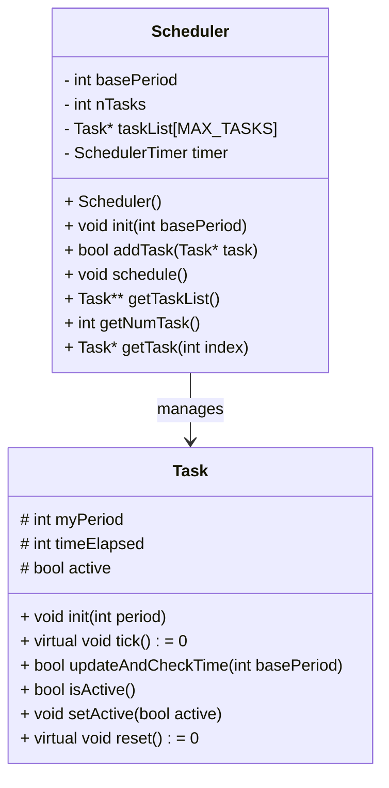
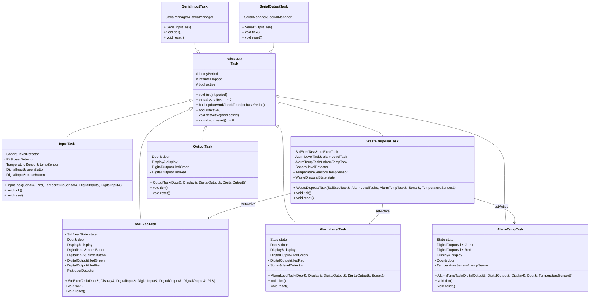
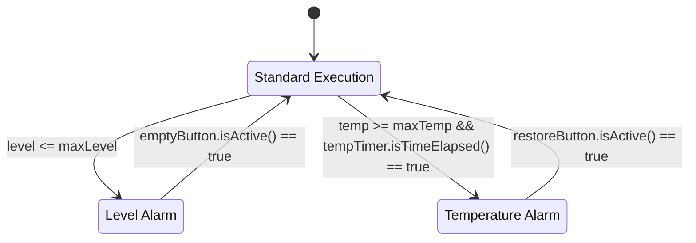
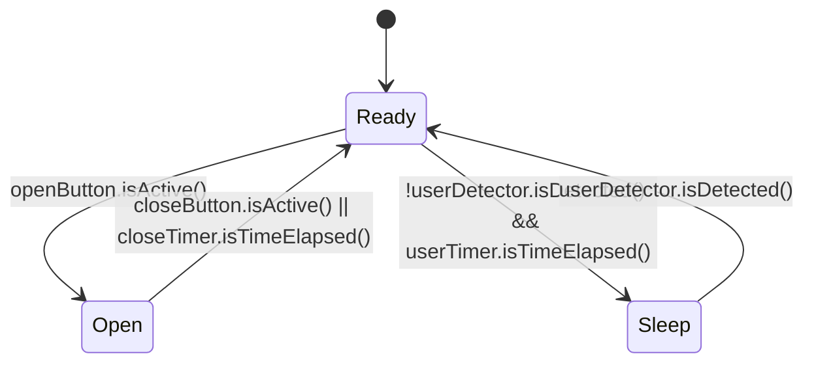
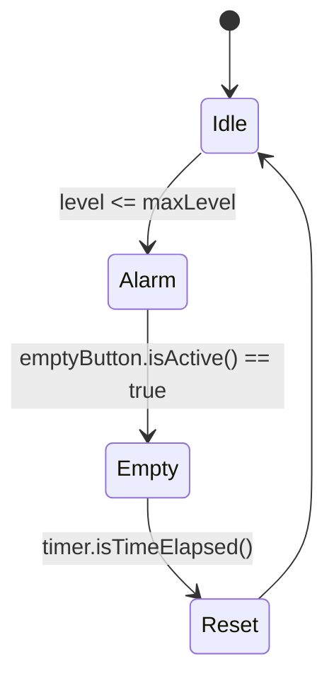
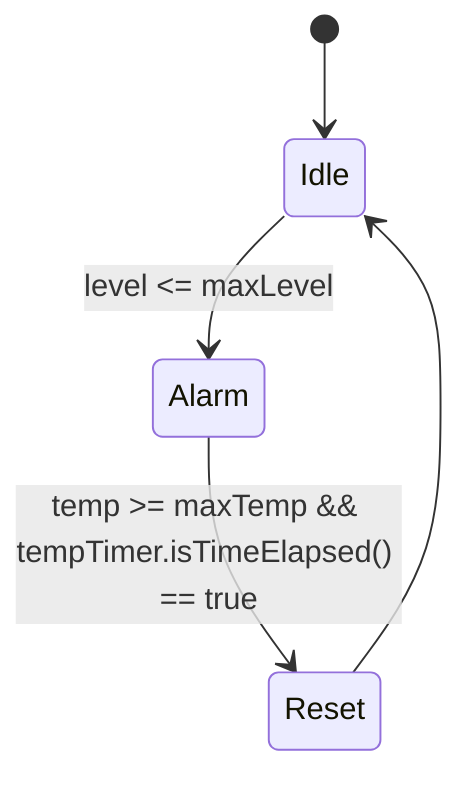

# Relazione Elaborato 2 IOT

Gruppo composto da :
- Giuseppe Gambacorta
- Enrico Cornacchia 0001070824
- Filippo Massari 0001071420

## Design

### Relazione tra Scheduler e Task
Il design globale del progetto si basa su un'architettura a `Task` amministrate da uno `Scheduler` che le gestisce in base ai loro periodi base.

#### Dettagli del Diagramma:
1. `Scheduler`:
   - Ha una relazione con `Task` tramite l'array `taskList`, che può contenere fino a `MAX_TASKS` oggetti `Task`.
   - Invoca i metodi delle istanze di `Task` attraverso il metodo `schedule`.
2. `Task`:
   - Classe astratta contenente i metodi `tick` e `reset`, che verranno implementati dalle specifiche task.

### Interoperatività delle Task
Le task `InputTask`, `WasteDisposalTask`, `StdExecTask`, `AlarmLevelTask`, `AlarmTempTask` e `OutputTask` sono implementazioni della classe astratta `Task`. Esse sono contenute nella `taskList` dello `Scheduler` e chiamate da quest'ultimo in base al loro stato di attività. Lo stato di attività delle task `StdExecTask`, `AlarmLevelTask` e `AlarmTempTask` è amministrato dalla task di management `WasteDisposalTask`.

#### Dettagli del Diagramma
**Dipendenze**:
   - `WasteDisposalTask` gestisce le sotto-task (`StdExecTask`, `AlarmLevelTask`, `AlarmTempTask`) e utilizza componenti come `Sonar` e `TemperatureSensor`.
   - `InputTask` legge sensori come `Sonar`, `Pir`, `TemperatureSensor` e interagisce con gli input digitali.
   - Altre task (es. `AlarmLevelTask`, `AlarmTempTask`) controllano output (es. LED, display) e interagiscono con i sensori o attuatori (es. `Door`, `Sonar`, `TemperatureSensor`).
   - `SerialInputTask` e `SerialOutputTask` dipendono da `SerialManager` e lo utilizzano per gestire le operazioni seriali.

## Specifiche delle Task

### InputTask
La `InputTask` viene chiamata dallo `Scheduler` come prima task e sfrutta il metodo `update` contenuto negli oggetti di input per aggiornarne il valore. Grazie a questo passaggio, abbiamo la sicurezza che le task successivamente schedulate lavoreranno sempre sugli stessi dati per il resto del periodo dello `Scheduler`.

### WasteDisposalTask
La `WasteDisposalTask` è la task che si occupa della gestione delle task `StdExecTask`, `AlarmLevelTask` e `AlarmTempTask`. Grazie alla sua azione, attiva e disattiva queste ultime permettendo la gestione dei casi critici.

### StdExecTask
La `StdExecTask` si propone di modellare la macchina a stati finiti che rappresenta le operazioni compibili dal bidone in assenza di condizioni critiche.

### AlarmLevelTask
L'`AlarmLevelTask` modella la gestione della criticità legata al riempimento del bidone.

### AlarmTempTask
L'`AlarmTempTask` modella la gestione di un raggiungimento critico di temperatura.

### OutputTask
La `OutputTask` viene chiamata dallo `Scheduler` come ultima task e sfrutta il metodo `update` contenuto negli oggetti di output per aggiornarne lo stato a livello hardware in un unico momento dello schedule.
